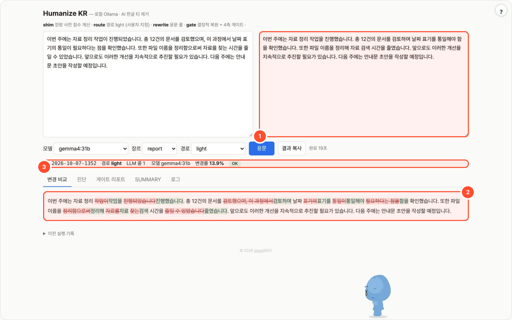
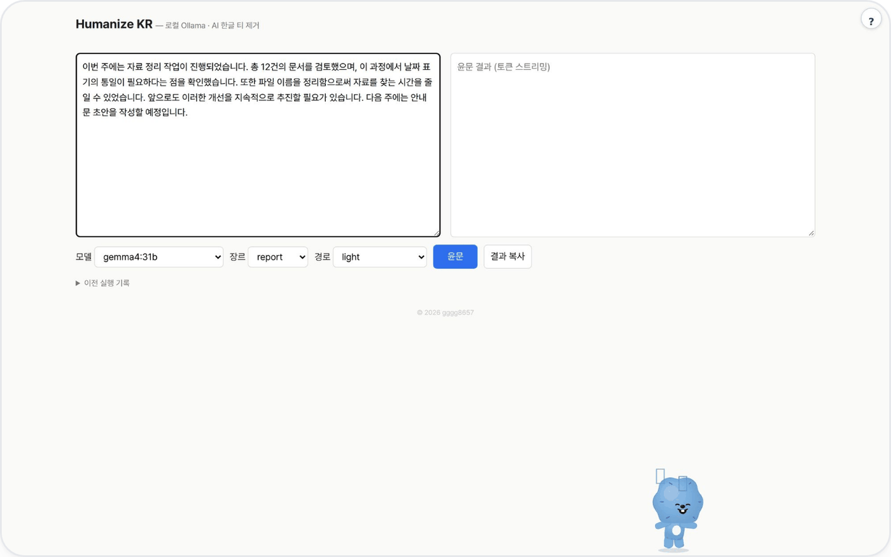

# humanize-kr-local — Humanize KR · 한국어 윤문

AI가 쓴 한글의 번역투·상투구·기계적 구조를 로컬 LLM으로 걷어내고, 원문과 결과를 비교한 뒤 변경률·수치·서법을 코드로 점검하는 웹 UI / CLI입니다.



## 무엇을 하나

- 오픈소스 Humanize KR([epoko77-ai/im-not-ai](https://github.com/epoko77-ai/im-not-ai), MIT)의 AI 한글 티 제거 파이프라인을 **Claude Code 없이** 로컬 LLM 서버(Ollama · vLLM 등 OpenAI 호환)로 돌립니다. 원본의 정량 점수·게이트 스크립트는 그대로 쓰고 LLM 호출 부분만 바꿨습니다.
- 경로 light / standard / heavy(1·2·3콜)와 결정적 게이트(변경률·구조·수치·서법), 롤백·finalize 규칙을 재현합니다.
- **의미 훼손 안전장치**: 변경률이 50%를 넘으면 보수 강도로 한 번 다시 윤문하고, 재시도도 ABORT면 원문을 반환합니다.
- 외부 의존성 0 — Python 3.9+ 표준 라이브러리만. 폴더 복사로 폐쇄망 배포.

## 사용 방법

포털 경유(`http://<포털>:8700/t/humanize-kr-local/`) 또는 단독 실행(`http://localhost:8765`) 화면에서:

1. **원문과 장르를 고른다** — 왼쪽 칸에 한국어 글을 붙여 넣고 장르(essay·column·report·blog·abstract)와 경로(auto 권장, 또는 light·standard·heavy)를 선택합니다.
2. **윤문을 실행한다** — 정량 점수 계산 → (필요 시) 진단 → 윤문 → 후처리·게이트 검사 순서로 진행되고, 오른쪽에 결과가 토큰 단위로 흘러나옵니다. (그림 ①)
3. **비교와 게이트를 확인한다** — 아래 **변경 비교** 탭에서 삭제(빨강)·추가(초록)를 보고(그림 ②), 실행 줄의 경로·LLM 콜 수·변경률·게이트 결과(그림 ③)와 **게이트 리포트**를 확인한 뒤 **결과 복사**. 경고가 있으면 원문과 대조합니다.

1만 5천 자 이상은 나눠서 넣으세요.

## 예시

가상 자료 정리 사례를 `gemma4:31b` · 장르 report · 경로 light로 실제 실행한 결과입니다(1콜, 약 19초, 변경률 13.9%, 게이트 OK, 재시도 없음).

입력:

```text
이번 주에는 자료 정리 작업이 진행되었습니다. 총 12건의 문서를 검토했으며, 이 과정에서 날짜 표기의 통일이 필요하다는 점을 확인했습니다. 또한 파일 이름을 정리함으로써 자료를 찾는 시간을 줄일 수 있었습니다. 앞으로도 이러한 개선을 지속적으로 추진할 필요가 있습니다. 다음 주에는 안내문 초안을 작성할 예정입니다.
```

출력:

```text
이번 주에는 자료 정리 작업을 진행했습니다. 총 12건의 문서를 검토하며 날짜 표기를 통일해야 함을 확인했습니다. 또한 파일 이름을 정리해 자료 검색 시간을 줄였습니다. 앞으로도 이러한 개선을 지속적으로 추진할 필요가 있습니다. 다음 주에는 안내문 초안을 작성할 예정입니다.
```

게이트 통과가 문장 품질 전체를 보증하지는 않습니다. 이 결과에서도 "앞으로도 이러한 개선을 지속적으로 추진할 필요가 있습니다"는 그대로 남았습니다.

<details><summary>입력 화면</summary>



</details>

## 설치 (스크립트 하나)

```bash
# macOS / Linux / Windows Git Bash — 클론 → Python 확인 → LLM 서버 탐색(없으면 Ollama 설치·기동·모델 pull) → 자가검증 → 웹 서버 → 브라우저
curl -fsSL https://raw.githubusercontent.com/gggg8657/humanize-kr-local/master/setup.sh | bash

# 이미 폴더가 있으면 (zip 반입 등)
bash setup.sh            # 시작
bash setup.sh stop       # 종료

# GPU 서버의 기존 LLM을 쓸 때 (탐색 생략)
LLM_BASE_URL=http://gpu-server:8000/v1 bash setup.sh          # vLLM 등 OpenAI 호환
LLM_BASE_URL=http://gpu-server:11434 bash setup.sh            # 원격 Ollama
```

Windows PowerShell:

```powershell
powershell -ExecutionPolicy Bypass -File setup.ps1          # 시작
powershell -ExecutionPolicy Bypass -File setup.ps1 stop     # 종료
```

탐색 순서: `LLM_BASE_URL` 지정 → localhost Ollama(11434) → OpenAI 호환(8000 vLLM · 1234 LM Studio · 8080 llama.cpp) → 없으면 Ollama 설치(brew / install.sh / winget) 후 `MODEL`(기본 `qwen3:8b`) pull.
폐쇄망에서 LLM 서버도 없고 인터넷도 없으면 서버 주소를 받아 오라는 안내와 함께 멈춥니다.

## 수동 실행

```bash
# Ollama (기본)
python3 app.py                                  # http://localhost:8765
LLM_MODEL=gpt-oss:20b python3 app.py

# OpenAI 호환 서버 (vLLM, LM Studio, llama.cpp server, TGI …)
LLM_API=openai LLM_BASE_URL=http://gpu-server:8000/v1 LLM_MODEL=Qwen3-32B python3 app.py

# CLI (stdin → JSON stdout, exit 2 = 게이트 ABORT)
python3 app.py --cli column heavy < input.txt

# LLM 없이 결정적 파이프라인만 자가 검증
python3 selftest.py
```

| 환경변수 | 기본 | 설명 |
|---|---|---|
| `LLM_API` | `ollama` | `ollama` 또는 `openai` |
| `LLM_BASE_URL` | `OLLAMA_HOST` 또는 `http://localhost:11434` / `http://localhost:8000/v1` | 서버 주소 |
| `LLM_MODEL` | `qwen3:8b` | 기본 모델 (UI에서 변경 가능). `OLLAMA_MODEL` 도 인식 |
| `LLM_API_KEY` | (없음) | OpenAI 호환 서버에 키가 필요할 때 |
| `NUM_CTX` | `16384` | Ollama 컨텍스트 창 (룰북 + 원문이 잘리지 않게) |
| `TEMPERATURE` | `0.2` | |
| `PORT` | `8765` | |
| `WORKSPACE` | `./_workspace` | 실행 기록 저장 위치 (포털이 `_data/humanize-kr-local` 로 지정) |

[agent-page-portal](https://github.com/gggg8657/agent-page-portal)에서 띄우면 `PORT`·`WORKSPACE`를 포털이 정하고, LLM 설정은 포털 프로세스의 환경변수를 물려받습니다. 현재 운영 기본값은 로컬 Ollama의 `gemma4:31b`입니다. 단독 실행 시 코드 기본값은 `qwen3:8b`입니다.

## 파이프라인

```
입력
 ├ scripts/prepare_monolith_input.py   위생(NFC·제로폭 제거) + 정량 점수 + route_hint     [LLM 0]
 ├ [standard·heavy] 진단 콜             roles/diagnostician.md + diagnosis-rules.md          [LLM 1]
 ├ 윤문 콜                              goal-prompt.md + quick-rules.md (토큰 스트리밍)      [LLM 1]
 ├ scripts/restore_modality.py         서법(당위·추측) 소실 문장을 원문으로 복원            [LLM 0]
 ├ scripts/strip_injected_commas.py    윤문이 새로 넣은 연결어미 쉼표 제거                  [LLM 0]
 ├ scripts/verify_gates.py             변경률 30%/50% · S1 목표달성 · 수치주입 · 서법 4축   [LLM 0]
 ├ [ABORT ≥50%]  보수 강도 롤백 재실행 1회 → 다시 ABORT면 원문 반환
 └ [heavy 또는 WARN]  finalizer 콜: 원문↔윤문본 대조 국소 보정 → 게이트 재실행              [LLM 1]
```

경로별 LLM 콜 수: light 1 · standard 2 · heavy 3 (롤백·finalize 승급 시 +1).

`goal-prompt.md`는 원본 SKILL.md와 `roles/monolith.md`에서 LLM이 지켜야 할 목표·불변 규칙·출력 계약만 추린 시스템 프롬프트이며,
실행 시 뒤에 `quick-rules.md`(85패턴 룰북)가 자동으로 붙습니다.

## 웹 UI

모델·장르·경로 선택 → 윤문. 진행 단계와 윤문 토큰이 실시간으로 표시되고, 결과는 **변경 비교(diff)** · 진단 · 게이트 리포트 · SUMMARY · 로그 탭으로 봅니다.
모든 실행은 `$WORKSPACE`(기본 `_workspace/`)`/{날짜-태그}/`에 원본·진단·중간본·최종본·`result.json`으로 남고, UI 하단 "이전 실행 기록"에서 다시 불러올 수 있습니다.

## 폴더 구조 (원본에서 동작에 필요한 것만)

```
app.py            서버 + 파이프라인 (단일 파일)
ui.html           웹 UI
goal-prompt.md    윤문 시스템 프롬프트 (이 패키지에서 작성)
selftest.py       LLM 없는 자가 검증
scripts/          원본 결정적 스크립트 그대로 (prepare_monolith_input · verify_gates · checks · restore_modality · strip_injected_commas · sanitize_text · console · verify_change_rate)
skills/humanize-korean/references/
  quick-rules.md        윤문 룰북 (85패턴 압축)
  diagnosis-rules.md    진단 전용 인덱스
  roles/*.md            진단·윤문·finalize 역할 정의
  metrics.py, metrics_v2.py, baseline*.json   정량 지표
```

원본 스크립트는 `skills/humanize-korean/references/` 경로를 상대로 참조하므로 레이아웃을 바꾸지 않았습니다.

## 초기 실측 (M-시리즈 Mac, PoC)

| 모델 | 경로 | 콜 | 소요 | 변경률 | 게이트 |
|---|---|---|---|---|---|
| qwen3:8b | standard | 2 | 약 90초 | 13% | OK |
| qwen3:8b | heavy | 3 | 약 3분 | 15% | WARN(구조축) → finalize |
| gpt-oss:20b | standard | 2 | 약 2분 | 낮음 | OK |

8B~20B급 로컬 모델은 이중피동·결론 접속사·기계적 열거는 잡지만 "~에 있어서", "~에 의해", "시사하는 바가 크다" 같은 번역투를 자주 남깁니다.
룰북이 아니라 모델 크기 문제이므로 GPU 서버에서는 30B 이상급 모델을 권합니다. 게이트가 의미 훼손은 막아 주므로 모델을 바꿔도 안전합니다.

## 한계 / 미구현

- 1만 5천 자 초과 청킹(`--chunk` + `reassemble_chunks.py`)은 넣지 않았습니다. 원본 실측상 단일 콜이 더 싸고 품질이 같습니다. 장문이 필요하면 추가.
- 진단·finalize 프롬프트는 원본 역할 정의를 그대로 씁니다. 로컬 모델용 few-shot 튜닝은 하지 않았습니다.

## 라이선스

이 패키지는 **[epoko77-ai/im-not-ai](https://github.com/epoko77-ai/im-not-ai)** (Humanize KR v2.3.2)의 파생물입니다.
`scripts/`, `skills/humanize-korean/references/` 아래 파일은 원본 저장소의 것을 수정 없이 가져왔고, `app.py` · `ui.html` · `goal-prompt.md` · `selftest.py`는 이 패키지에서 새로 작성했습니다.
원본 저작권은 원저자(epoko77-ai)에게 있으며, 원본과 동일하게 [MIT License](LICENSE)로 배포합니다. `NOTICE` 참조.

## 출처·감사 (Credits)

- **원본: [epoko77-ai/im-not-ai](https://github.com/epoko77-ai/im-not-ai)** (Humanize KR v2.3.2, MIT) — `scripts/`, `skills/humanize-korean/references/` 는 원본 그대로입니다. 원본 저작권은 원저자에게 있습니다.
- **LLM 실행** — OpenAI 호환 API 로 호출합니다(모델 가중치는 동봉하지 않음). 기본 배포는 [Ollama](https://github.com/ollama/ollama) (MIT) 위의 Google [Gemma](https://ai.google.dev/gemma) `gemma4:31b` — 모델 이용 조건은 Gemma 배포처 참고.
- 이 도구는 [agent-page-portal](https://github.com/gggg8657/agent-page-portal) 에 연결해 쓰도록 만들었습니다(단독 실행도 됨).

저작권 표기·전체 목록은 `NOTICE` 를 보세요.
